> SK네트웍스 Family AI 캠프 19기 4차 프로젝트  
> 개발기간: 25.11.26 ~ 25.12.17 <br>
> 주제 : LLM을 연동한 내외부 문서 기반 질의 응답 시스템

<br>

---

# 📚 목차

1. [팀 소개](#%EF%B8%8F-%ED%8C%80-%EC%86%8C%EA%B0%9C)
2. [프로젝트 개요](#-%ED%94%84%EB%A1%9C%EC%A0%9D%ED%8A%B8-%EA%B0%9C%EC%9A%94)
3. [기술 스택 & 사용한 모델](#-%EA%B8%B0%EC%88%A0-%EC%8A%A4%ED%83%9D--%EC%82%AC%EC%9A%A9%ED%95%9C-%EB%AA%A8%EB%8D%B8)
4. [시스템 아키텍처](#%EC%8B%9C%EC%8A%A4%ED%85%9C-%EC%95%84%ED%82%A4%ED%85%8D%EC%B2%98)
5. [WBS](#-wbs)
6. [요구사항 명세서](#%EF%B8%8F%E2%83%A3-%EC%9A%94%EA%B5%AC%EC%82%AC%ED%95%AD-%EB%AA%85%EC%84%B8%EC%84%9C)
7. [화면 설계서](#️-화면-설계서)
8. [테스트 계획 및 결과 보고서](#-%ED%85%8C%EC%8A%A4%ED%8A%B8-%EA%B3%84%ED%9A%8D-%EB%B0%8F-%EA%B2%B0%EA%B3%BC-%EB%B3%B4%EA%B3%A0%EC%84%9C)
9. [트러블 슈팅](#-트러블-슈팅)
10. [수행결과(시연 페이지)](#-%EC%88%98%ED%96%89%EA%B2%B0%EA%B3%BC%EC%8B%9C%EC%97%B0-%ED%8E%98%EC%9D%B4%EC%A7%80)
11. [추후 개선 예정](#-추후-개선-예정)
12. [한 줄 회고](#%EF%B8%8F-%ED%95%9C-%EC%A4%84-%ED%9A%8C%EA%B3%A0)

<br>

---

# 🖐️ 팀 소개

- ## 팀명 : **맺음**
- ### 팀원 소개 :

<div align="center">
	
| [@배상준](https://github.com/WindyAle) | [@박소희](https://github.com/xxoysauce) | [@이승원](https://github.com/seungwon-sw) | [@김성욱](https://github.com/souluk319) | [@박진형](https://github.com/vispi94) |
| :----------------------------------------: | :----------------------------------------: | :----------------------------------------: | :----------------------------------------: | :----------------------------------------: |
|  |  |  |  |  |

</div>

<br>

---

# 📖 프로젝트 개요

##  주제 : 남은 인생을 후회 없이 잘 살고, 품위 있는 끝맺음을 준비하며, <br> 새로운 삶의 의미를 찾아가는 과정을 돕는 AI 기반의 '대화 상대' 챗봇 서비스

- ###  **프로젝트 소개**

"**라잎클로버**"는 사용자가 남은 삶을 정돈하고 의미를 찾을 수 있도록 돕는 AI 대화형 챗봇 서비스입니다.  
**상속, 장례 절차, 인터넷 계정 관리, 정서 상담 등 다양한 주제를 RAG 기반으로 안내**하며  
**사용자의 감정·기억까지 반영된 맞춤형 대화를 제공**합니다.

- ###  **프로젝트 배경**

삶의 마무리 과정(상속·장례·연명의료 등)에 대한 정보 수요가 증가하고 있지만,<br>
궁금한 정보를 다양하게 제공하거나 정서적 부담으로 주변에 쉽게 이야기하기 어려운 고민을<br>
한 곳에서 상담/안내해주는 통합 서비스는 부족합니다.

- **현대 사회 이슈**
   -   고령화 사회 심화
   -   독거노인 + 1인 가구 증가
   -   무연고자 사망 증가

<details>
<summary>관련 기사</summary>

### ■ 무연고 사망 증가

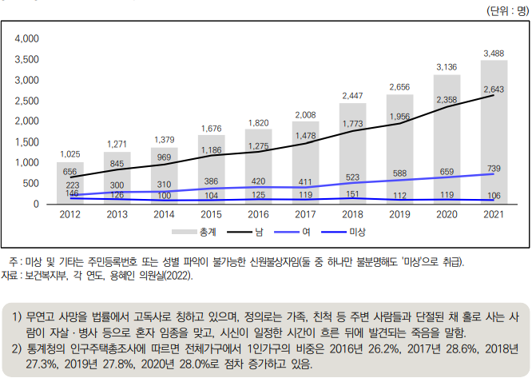

- 무연고 사망자는 년마다 증가하는 추세이며, 통계에 잡히지 않는 불특정 다수도 있어 관심과 대책이 요망됨.

[https://repository.kli.re.kr/bitstream/2021.oak/6926/2/%EB%85%B8%EB%8F%99%EB%A6%AC%EB%B7%B0_no.208_2022.7_7.pdf](https://repository.kli.re.kr/bitstream/2021.oak/6926/2/%EB%85%B8%EB%8F%99%EB%A6%AC%EB%B7%B0_no.208_2022.7_7.pdf)
##### 출처: 보건복지부


### ■ 고령화 + 1인 가구


-   한국은 2025년 초고령사회 진입.
    
-   노년층 1인 가구 폭증 → 죽음 준비·장례 절차의 정보 접근성 낮음.    
[https://kostat.go.kr/portal/korea/kor_nw/1/1/index.board?bmode=read&aSeq=429567?utm_source=chatgpt.com](https://kostat.go.kr/portal/korea/kor_nw/1/1/index.board?bmode=read&aSeq=429567?utm_source=chatgpt.com)
##### 출처: 통계청

## 해외 죽음 준비 문화 동향
	
### ■ 일본의 ‘슈카츠(終活, Shukatsu)’ 확산

-   일본에서는 **자기 죽음을 준비하는 활동 전체**를 가리키는 말로 ‘슈카츠(終活)’가 이미 널리 사용됨. [위키백과](https://en.wikipedia.org/wiki/Shukatsu_%28end-of-life_planning%29?utm_source=chatgpt.com)

-   주체적인 삶의 마무리, 남겨진 가족의 부담 경감, 현재 삶의 재발견과 성찰, 물리적 정리를 대비하는 문화<br>
   Shukatsu 개념 정리(위키피디아) <br>
   [](https://en.wikipedia.org/wiki/Shukatsu_(end-of-life_planning))[https://en.wikipedia.org/wiki/Shukatsu_(end-of-life_planning)](https://en.wikipedia.org/wiki/Shukatsu_(end-of-life_planning))

### ■ 미국 – Legacy AI / Digital Afterlife 시장 등장

- “StoryWorth”: AI 기반 인생 회고 스토리북 생성 서비스 → 미국에서 급성장.
    
    출처: StoryWorth 공식
    
    https://welcome.storyworth.com/?utm_source=chatgpt.com
    
- “HereAfter AI”: AI가 사용자의 생전 음성·이야기를 기록 → 유족이 대화 가능.
    
    출처: HereAfter
    
    https://www.hereafter.ai/?utm_source=chatgpt.com

<br>

#### => 해외에는 `웰다잉 Well Dying (남은 삶을 어떻게 잘 살아내고 마무리할 것인지)` 문화가 성행하나 국내에선 낯설고 관심 부족한 상태
	
### "이러한 배경에서 저희는 **신뢰할 수 있는 안내/대화 서비스의 필요성**을 느끼고 도움을 줄 수 있는 챗봇을 구상하게 되었습니다."

</details>

- ### **프로젝트 목표**

1.  **핵심 정보 제공**: 상속·장례·인터넷 개인정보 처리 등 삶의 마무리에 필요한 정보를 정확하게 안내
    
2.  **맞춤형 대화**: 감정·기억을 반영한 개인화된 상담 제공
    
3.  **RAG 기반 정확성 향상**: GPT-4o + Pinecone으로 근거 기반 답변 생성
    
4.  **사용자 중심 UI 구현**: (여기에 구현 프로그램 명 입력) 을 사용한 모바일 최적화 인터페이스로 간편한 이용 환경 제공

<br>

---

# 💻 기술 스택 & 사용한 모델  

| 분야                | 사용 도구 |
|---------------------|-----------|
| **Language**        | [](https://www.python.org/) |
| **Collaboration Tool** | [](https://git-scm.com/) [](https://github.com/) [](https://www.notion.so/) [](https://discord.com/) |
| **LLM Model**       | [](https://platform.openai.com/) 
| **Embedding Model** | [](https://platform.openai.com/docs/guides/embeddings) |
| **Vector DB**       | [](https://www.pinecone.io/) |
| **Orchestration / RAG** | [](https://www.langchain.com/) [](https://langchain-ai.github.io/langgraph/) |
| **Frontend** |    |
| **Development Env** | [](https://code.visualstudio.com/) [](https://www.anaconda.com/)

<br>

---

# 🪢시스템 아키텍처

### 프로젝트 구조

```
Lifeclover/
├── manage.py                 # Django 실행 진입점
├── config/                   # Django 프로젝트 설정
│   ├── settings.py           # 환경/앱/미들웨어 설정
│   └── urls.py               # 프로젝트 URL 라우팅
│
├── web/                      # 메인 Django 앱
│   ├── views.py              # 페이지 & API 뷰
│   ├── models.py             # 사용자/대화 관련 모델
│   ├── member_manager.py     # 회원 관리 로직
│   └── migrations/           # DB 마이그레이션
│
├── templates/                # Django HTML 템플릿
│   ├── base.html             # 공통 레이아웃
│   └── index.html            # 메인 페이지
│
├── static/                   # 정적 리소스
│   ├── css/                  # 스타일시트
│   ├── js/                   # 프론트엔드 로직
│   └── img/                  # UI 이미지/로고
│
├── chatbot/                  # 챗봇 엔진
│   ├── conversation_engine.py# 대화 흐름 제어
│   └── chatbot_modules/      # 에이전트/세션/LLM 연동 모듈
│       ├── info_agent.py     # 정보 제공 에이전트
│       ├── empathy_agent.py  # 공감형 응답 에이전트
│       └── diary_manager.py  # 다이어리 관리
│
├── data/                     # 서비스 데이터
│   ├── raw/                  # 법령·조례 등 원본 데이터
│   ├── processed/            # 전처리/청킹 데이터
│   └── image/                # 문서/README용 이미지
│
├── scripts/                  # 데이터 전처리·적재 스크립트
└── sql/                      # DB 초기 설정 스크립트
```

<br>

### 시스템 아키텍처 구조도


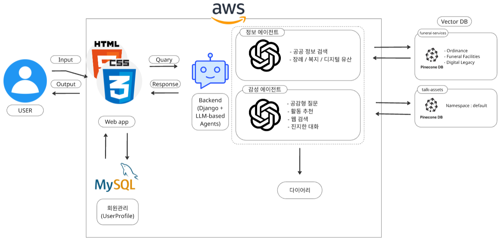

<br>

### 프롬프트 엔지니어링

**챗봇 역할 부여**

```
    # 시스템 프롬프트 정의
    system_prompt = SystemMessage(content="""
    당신은 'Well Dying(웰다잉)'을 주제로 사용자에게 유산상속, 장례절차, 정부지원금, 디지털 유산 등 포괄적인 정보를 제공하는 챗봇입니다.
    제공된 문서를 바탕으로 정확하고 친절하게 답변하세요.
사용자의 질문에 대해 제공된 법률 문서와 안내 자료를 바탕으로 정확하고 친절하게 답변해주세요.
```

**도구 사용 및 지역 처리 핵심 지침**
```
    1. **시설 검색 (`search_funeral_facilities`) 규칙:**
    - **목적:** 장례식장, 봉안당, 묘지, 화장장 등의 위치를 찾을 때 사용합니다.
    - **복수 지역 허용:** 사용자가 '수도권', '서울 근교', '서울과 수원 사이' 등 넓은 범위를 말하면, 관련된 시/군/구를 추론하여 `regions` 인자에 **리스트 형태**로 **최대3개** 입력하세요.
        (예: `regions=["안양시", "의왕시", "군포시"]`)
    - 한 지역 검색: 한 지역을 검색할 경우 region인자에 string타입으로 넣어줘서 지역을 찾습니다. (예: `region ="충남"`)
    - 사용자가 아예 지역을 입력하지 않으면 먼저 정중하게 지역을 확인하세요.

    2. **조례/지원금 검색 (`search_public_funeral_ordinance`, `search_cremation_subsidy_ordinance`) 규칙:**
    - **목적:** 공영장례 지원이나 화장 장려금 등 지자체 행정 지원을 찾을 때 사용합니다.
    - **단일 지역 필수:** 지원금은 **'고인의 주민등록상 거주지'**가 기준이므로, 반드시 **하나의 명확한 지역명(문자열)**만 `region` 인자에 입력해야 합니다.
    - **모호한 경우:** 만약 사용자가 "수도권의 화장장려금 알려줘"라고 묻는다면, 리스트로 검색하지 말고 **"정확한 안내를 위해 거주하시는 시/군/구를 말씀해 주시겠어요?"**라고 되물어보세요.
    - 사용자가 구체적인 지역을 언급하지 않았다면, 먼저 정중하게 구체적인 지역을 확인하세요.
                                  
    3.  **디지털 유산 검색 (`search_digital_legacy`) 규칙:**
    - **목적:** 디지털 유산을 찾을 때 사용합니다.
    - 사용자의 목적이 다른 고인의 정보를 처리하기 위함인지, 본인이 직접 계정을 관리하기 위함인지 파악하고 올바른 답을 줍니다.
    
                    
    4.  **유산 검색 (`search_legacy`) 규칙:**
    - **목적:** 유산을 찾을 때 사용합니다.
    - 유산 관련 정보는 웬만하면 답변할 때 법적 근거를 확실히 제시해주세요.
                                  
    5. **공통 대화 태도:**
    - 검색 결과가 없을 경우, 솔직하게 해당 지역의 정보가 없음을 알리고 인근 지역이나 대안을 제시해 주세요.
    - 항상 따뜻한 위로와 공감의 말을 잊지 마세요.
    """)
```

**특수한 대화 유의사항 명시**
```
[해결책의 구체성]
- 모호한 조언 대신 **구체적이고 실천 가능한 행동**을 제안하세요.
  (X) "마음을 편하게 가지세요."
  (O) "지금 당장 종이에 걱정되는 것 3가지만 적어보세요. 그리고 구겨서 휴지통에 버려보는 건 어떨까요?"
  (O) "눈을 감고 5초 동안 숨을 깊게 들이마셔 보세요."

[의료적 정확성 및 팩트 체크]
- 사용자가 의학적 용어를 잘못 사용하더라도(예: "시스플라틴을 먹고 있어"), 앵무새처럼 따라 하지 마세요.
- **정확한 표현으로 교정**해서 공감하세요. (예: "시스플라틴 치료를 받으시느라 몸이 많이 힘드시죠.")
- 약물이나 치료법에 대해 섣불리 조언하지 말고, 의료진의 영역을 침범하지 않되 환자의 고통에는 깊이 공감하세요.

[통증 레벨에 따른 대응]
- 사용자가 "미치겠어", "너무 아파", "죽을 것 같아" 등 극심한 고통을 호소할 경우:
  - **절대 금지**: 독서, TV 시청, 산책 등 **집중력이 필요한 능동적 활동**을 추천하지 마세요.
  - **권장**: 호흡법, 상상 요법, 듣기 편한 음악 등 **수동적이고 감각을 이완시키는 활동**을 제안하세요.

[무한 루프 방지]
- 사용자가 "의사가 안 된대", "병원에서도 방법이 없대"라고 말하면:
  - **절대 금지**: "의사 선생님과 다시 상의해보세요"라는 말을 하지 마세요. (사용자에게 좌절감을 줍니다.)
  - **대응**: 의료적 한계를 인정하고, **지금 당장 해줄 수 있는 정서적 지지**나 **통증 일기 쓰기** 같은 보조적인 수단을 제안하세요.
```
<br>

---

# 📅 WBS


<br>

---

# *️⃣ 요구사항 명세서

**시작 페이지 관리 (SP)**

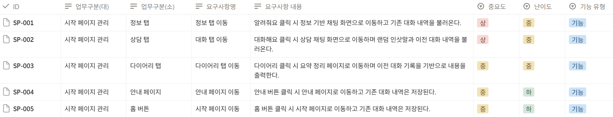<br>

**안내 페이지 관리 (INFO)**

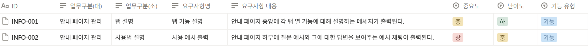<br>

**채팅 페이지 관리 (CHAT)**

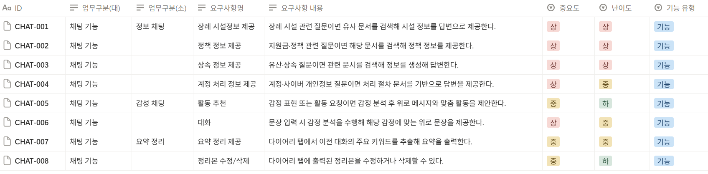<br>

**회원 관리 (MBM)**

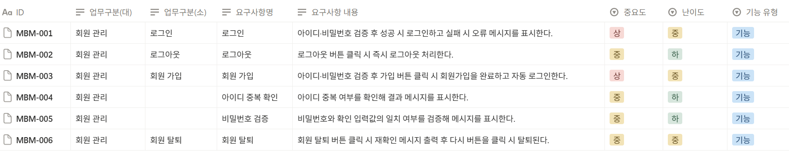<br>

**세션 관리 (SES)**

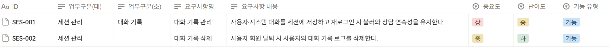<br>

**비기능 요구 사항 (NFR)**

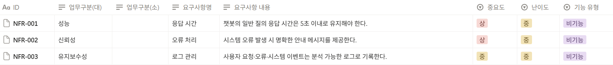<br>

<br>

---

# 🖥️ 화면 설계서

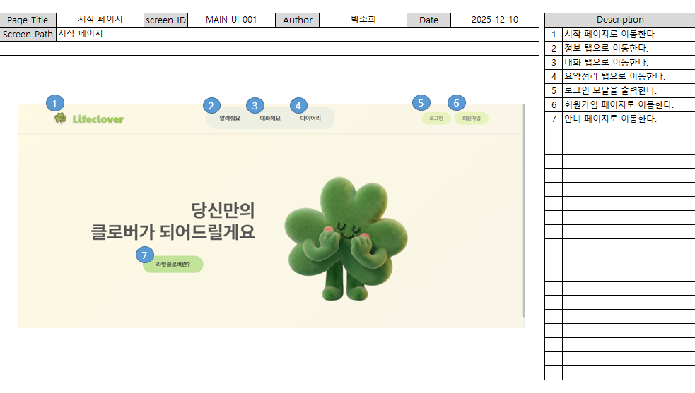<br>

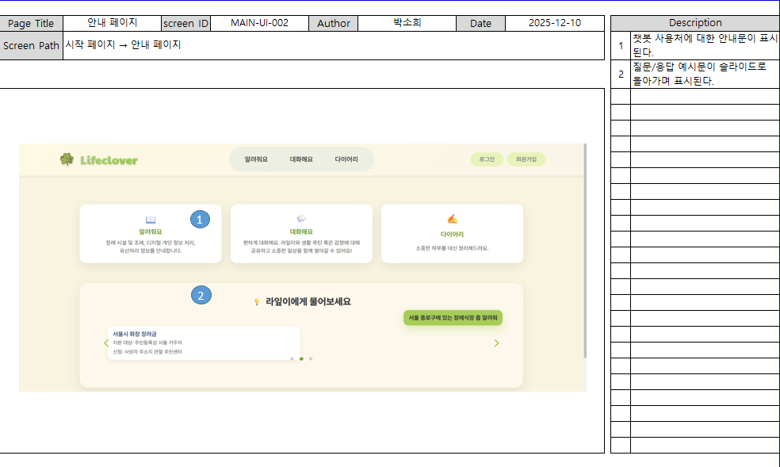<br>

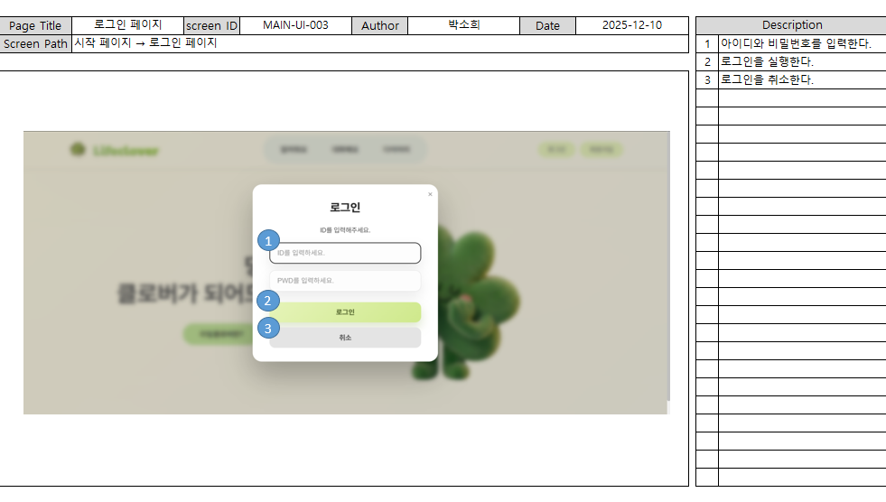<br>

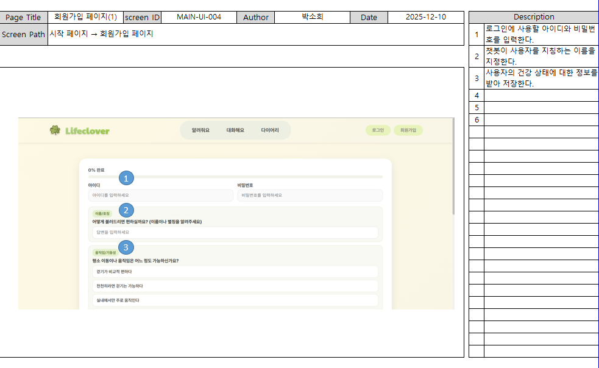<br>

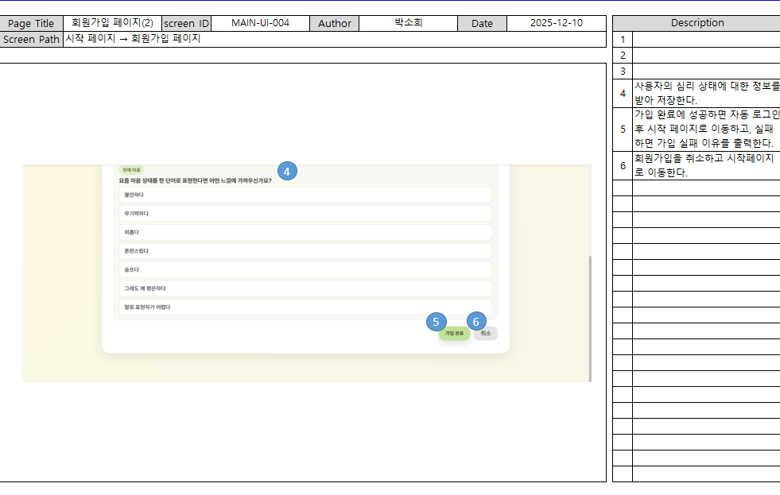<br>

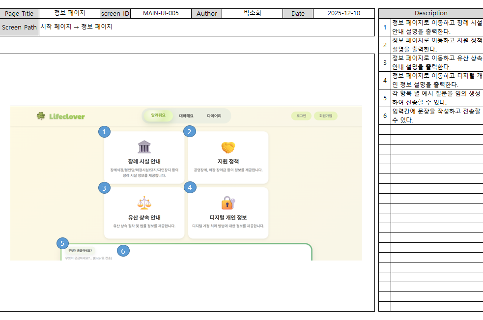<br>

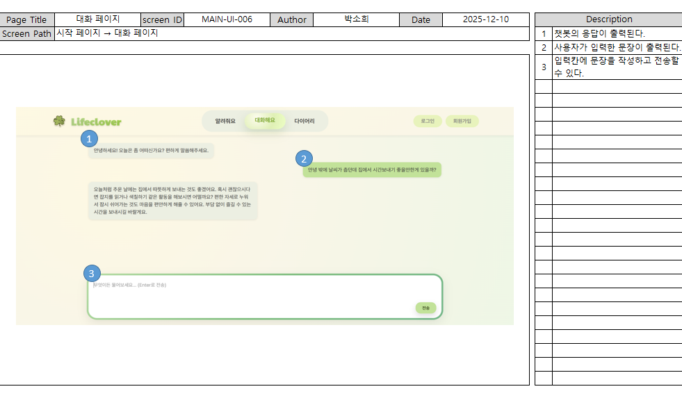<br>

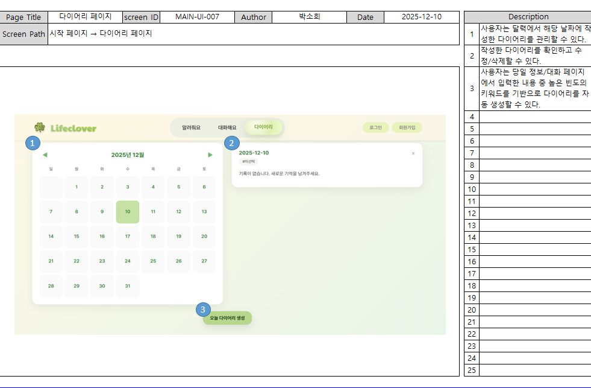<br>

<br>

---

# 💡 테스트 계획 및 결과 보고서

<br>

**1. 테스트 목적 및 판단 기준**

| 구분           | 판단 기준                                     |
|--------------|------------------------------------------|
| 가독성          | 데이터를 사용자가 이해하기 쉬운 형태로 가져오는지       |
| 정보 정확성       | 정보 전달 시 잘못된 내용이 없는가          |
| 상황 대응 능력     | 대화의 문맥을 파악하는가   |

<br>

**2. 테스트 질문 바리에이션**

| 목적 | 질문 예시 | 질문 선정 이유 |
|----|---------|--------------|
| 가독성 | "사망 후 디지털 계정 처리 방법이 궁금해요." | 정보 구조 검증(장문 설명이 필요한 주제를 통해 정보가 목록·단계 등 구조화된 형태로 제공되는지 확인) |
| 정보 정확성 | "서울시 서대문구에 거주하는 기초수급자인데 장례관련 지원금제도가 있는지 궁금해." | 조건 기반 정보 정확성(지역·계층 조건에 따라 제도 정보가 정확히 전달되는지 검증) |
| 상황 대응 능력 | "서울시 동대문구에 거주하는 기초수급자인데 장례관련 지원금제도가 있는지 궁금해" <br> → "차상위계층인데 장례혜택을 받을 수 있어?" | 연속 질문 맥락 유지(동일 주제에서 조건이 변경된 연속 질문에 대해 이전 문맥을 고려해 응답하는지 확인) |

<br>

**3. 테스트 중 발견된 문제점**

| 구분        | 발견된 문제                                 |
|-----------|------------------------------------------|
| 구조적 가독성 저하     | 줄 바꿈 없음 등 구조적 미흡으로 가독성 저하 |
| 답변 상태 미흡   | DB 내 연관된 데이터를 제대로 활용하지 못함    |
| 문맥 파악 실패   | 앞선 문맥을 파악하지 못해 예상과 다른 답변 출력 |

<br>

**4. 문제 개선을 위한 조치**

| 개선 항목     | 적용 내용                                               |
|-------------|------------------------------------------------------|
| 구조 보완   | 출력 문구의 구조 재구성, 사용자에게 정확한 질문 방법 제시          |
| 답변 상태 개선     | 데이터 활용 및 출력 방향 개선  |
| 문맥 프롬프트 조치 | 프롬프트 수정으로 자연스러운 대화 가능하도록 조치          |

<br>

**5. 개선 전 / 후 비교**

- 가독성

<br>

<br>

→ 줄 바꿈 등 구조 일괄 조정, 사용자에게 구체적인 질문 방법 제시

<br>

- 정보 정확성

<br>

<br>

→ 포괄적인 답변 대신 조건 별 정확한 정보 제공

<br>

- 상황 대응 능력

<br>

<br>

→ 앞서 동대문구 관련 질문을 하고 이어진 대화에서 문맥을 유지하여 올바른 답변 제출

<br>

---

# 🐛 트러블 슈팅

### 1. 다이어리 "유령 대화" 기록 현상

- 다이어리를 생성할 때, 사용자가 **로그인한 상태**임에도 불구하고 시스템이 **비회원(게스트)용 ID(쿠키)**로 대화 기록을 찾으려 시도
- 결과 게스트용 대화내용과, 유저의 대화가 합쳐져 기록됨

<br>

파일 위치: web/views.py

**문제 파악**

- 로그인 여부를 확인하지 않고, 무조건 쿠키 값만 가져옴. 로그인한 유저의 username은 무시.

```
def generate_diary(request):
# ... (생략) ...

# [문제 코드]
# 로그인한 사람도 강제로 '게스트 쿠키 ID'를 사용하게 됨
user_id = request.COOKIES.get("user_uuid", "guest")

try:
    engine = get_conversation_engine()
    # ... (이하 생략) ...
```

**조치 내용**

- request.user.is_authenticated를 통해 로그인 여부를 먼저 판단.

```
def generate_diary(request):
# ... (생략) ...

# [해결 코드]
# 1. 로그인 상태인지 확인
if request.user.is_authenticated:
    # 로그인 했다면: DB에 저장된 'username' 사용 (예: "souluser")
    user_id = request.user.username
else:
    # 로그인 안 했다면: 브라우저 쿠키의 'user_uuid' 사용 (예: "a1b2-c3d4...")
    user_id = request.COOKIES.get("user_uuid", "guest")

try:
    engine = get_conversation_engine()
    # ... (이하 생략) ...
```

**수정 후 확인**

<br>

<br>

**결과 / 검증 포인트**

→ 로그인 여부에 따른 다이어리 생성 확인

<br>

---

### 2. 채팅 UI 스크롤 튐 / 레이아웃 흔들림 문제

- 스크롤 시 채팅 메시지 영역이 위아래로 튐/흔들림
- 메시지 영역과 입력창이 겹치거나 입력창이 떠서 보이는 현상
- 스크롤바가 여러 개 나타나거나 자동 스크롤이 중간에 멈춤
- 탭 전환 후에도 레이아웃이 깨진 상태로 유지됨

<br>

**문제 파악**
1. CSS 중복/충돌
    - 동일 요소에 서로 다른 overflow / height / position 규칙이 여러 위치에서 정의됨
    - (예: body.chat-mode, .page-section.active[data-page="chat"/"services"], .chat-shell / .chat-panel / .chat-messages)
2. 스크롤 컨텍스트 중첩
    - 전역 스크롤(body, 상위 섹션)과 내부 스크롤(.chat-messages)이 동시에 활성화됨
    - 이로 인해 스크롤바 중복 및 자동 스크롤 계산 오류 발생
3. 입력창 고정 방식 문제
    - 입력창을 position: fixed로 고정한 상태에서 메시지 영역 높이 보정이 일관되지 않아 겹침 및 레이아웃 점프 발생

<br>

**조치 내용**
1. 스크롤 일원화
    - 메시지 영역(.chat-messages)만 overflow-y: auto 유지
    - body.chat-mode 및 상위 섹션은 스크롤을 차단해 스크롤바를 하나로 통합
2. 중복 CSS 규칙 정리
    - 채팅 관련 레이아웃(body.chat-mode, .page-section, .chat-shell, .chat-panel, .chat-messages)에서 최종 의도를 반영한 규칙만 남기고 중복 정의 제거
    - 각 속성(overflow, height, position)은 한 곳에서만 책임지도록 정리
3. 입력창 레이아웃 안정화
    - position: fixed 사용을 제거하고 relative 기반 구조로 통일
    - 입력창은 고정 높이(min-height)를 유지해 레이아웃 변동 방지
4. 페이지 전환 상태 초기화
    - 탭 전환 시 퀵 패널/오버레이 상태 클래스를 초기화해 이전 페이지 UI가 남지 않도록 처리

<br>

**현재 유지 중인 핵심 규칙 (재발 방지 기준)**

```
body.chat-mode { overflow: hidden; }
.chat-messages { overflow-y: auto; padding: 18px; }
.chat-input-container { position: relative; min-height: 110px; }
```

<br>

**수정 후 확인**

(수정 전)<br>
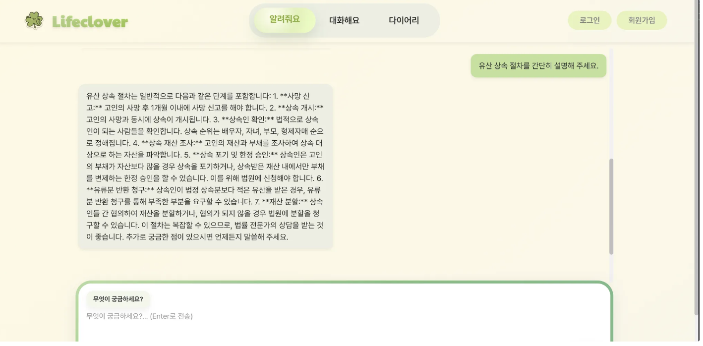<br>

(수정 후)<br>
<br>

**결과 / 검증 포인트**
- 스크롤바가 하나만 표시됨
- 메시지 영역과 입력창이 겹치지 않음
- 스트리밍 응답 중에도 레이아웃이 흔들리지 않음
- 탭 전환 후에도 자동 스크롤과 레이아웃이 정상 유지

<br>

---

### 3. 구분 없는 표 형식 텍스트 추출 문제

- 타 지역 조례집 데이터를 추가 수집하여 데이터베이스에 재적재하는 과정에서,<br> 
3차 프로젝트 당시 경험했던 데이터 추출 문제가 다시 발생함.<br>
- 기존 프로젝트에서는 PDF 내 텍스트를 직접 드래그하여 수작업으로 추출했으나,<br> 
데이터 양이 크게 증가하면서 해당 방식은 더 이상 적용이 어려운 상황이었음.<br>

**문제 파악**

- PDF 문서 내 텍스트가 컬럼 형태로 배치되어 있으나 표 형태로 구분되지 않음
- 행과 열 구분 정보가 없어 단순 텍스트 추출 시 데이터 구조가 무너짐
- 결과적으로 자동화된 방식으로 데이터를 안정적으로 추출하기 어려운 상태

**조치 내용**

1. easyOCR 기반 텍스트 정렬 시도
    - 바운딩박스("바운딩 박스": OCR 결과로 인식된 텍스트의 위치 좌표) 정보를 활용
    - 텍스트의 x좌표 중앙값이 유사한 항목끼리 묶어 컬럼 형태로 재정렬
    - 다만, 한글 인식률이 낮아 일부 데이터 누락 및 오인식 문제 발생
2. pdfplumber 기반 방식으로 전환
    - pdfplumber의 바운딩박스 정보를 활용해 동일한 좌표 기반 정렬 로직 적용
    - OCR 방식이 아닌 PDF 내부 좌표 정보를 직접 활용함으로써 한글 인식 정확도와 데이터 안정성 문제를 개선
    - 최종적으로 대량 데이터에 대해 자동화된 추출 및 재적재 가능

<br>

---

### 4. 대화해요 탭 진지함 점수 출력 문제

- 스트리밍 방식으로 출력을 변경하는 과정에서, 대화해요 탭 응답에 진지함 점수가 함께 출력되는 문제가 발생하였다.

**문제 파악**
- 에이전트 내 모든 출력을 스트리밍으로 수집하는 구조로 인해,<br>
진지함 점수 계산 결과 또한 사용자 응답과 함께 출력됨 확인

**조치 내용**
- 진지함 점수 계산에 사용되는 invoke() 호출에<br>
config={'callbacks': []} 옵션을 적용하여 해당 출력이 노출되지 않도록 수정.

<br>

---

### 5. 브라우저 캐시로 app.js 미반영(0KB / pending) 문제

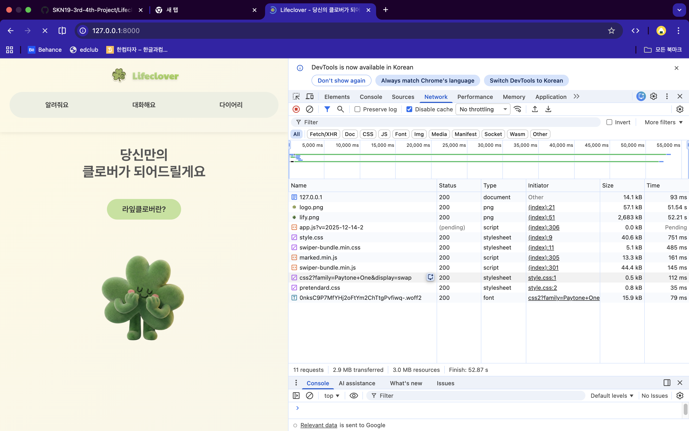<br>

- 버튼/탭 등 UI가 전혀 동작하지 않음
- 콘솔에 Unexpected end of input 에러 발생
- Network 탭에서 app.js가 0KB 또는 pending 상태로 표시됨

<br>

**문제 파악**
- 브라우저가 이전에 캐시된 app.js를 계속 재사용함
- 캐시된 JS가 불완전한 상태(0KB)로 로드되어 파싱 에러 발생
- 서버 설정이나 코드 자체의 문제는 아님

<br>

**조치 내용**
1. 캐시 버스터 적용
    - 정적 스크립트 URL에 버전 쿼리를 추가해 브라우저가 최신 파일을 다시 요청하도록 유도

```  
  <script src="/static/js/app.js?v=2025-12-14-3"></script>
```  
  
2. 브라우저 캐시 초기화
    - 강력 새로고침: Cmd / Ctrl + Shift + R 또는 시크릿 창에서 재접속

**검증 포인트**
- Network 탭에서 app.js가 정상 용량(약 44KB)으로 200 응답되는지 확인
- 콘솔 에러(Unexpected end of input)가 사라지는지 확인
- 버튼, 탭 등 UI 동작이 정상화되는지 확인

<br>

**재발 방지**
- 정적 JS 수정 시 버전 쿼리(?v=YYYY-MM-DD-N)를 함께 갱신
- 배포/병합 후에는 강력 새로고침 또는 시크릿 모드로 최종 검증

<br>

---

### 6. 여러 계정 로그인 시 대화 내역 혼선

- 하나의 기기에서 여러 계정으로 로그인할 때 챗봇이 각 계정을 별개의 사용자로 인식하지 못함.<br>

- 예시: '김김' 계정으로 로그인<br> 
→ '김김' 로그아웃<br> 
→ '밍밍' 계정으로 로그인<br> 
→ 챗봇: “안녕하세요, 김김님!”

<br>

**문제 파악**
1. 로그아웃 엔드포인트 부재
    - 로그아웃 함수는 존재하지만 이를 호출하는 view 함수가 없음
2. 프론트엔드 로그아웃 미흡
    - UI를 그리는 코드(app.js)의 로그아웃 버튼이 백엔드를 호출하지 않고 프론트엔드 상태(state)만 초기화
    - 로그아웃 시에도 Django 세션이 종료되지 않아 서버는 여전히 이전 사용자로 인증된 상태 유지
3. user_uuid 쿠키 미삭제
    - 로그아웃 시 쿠키(user_uuid)가 삭제되지 않아 다음 로그인 시 이전 세션 재사용 위험

**조치 내용**
1. Logout API 엔드포인트 추가 `web/views.py`
    - 회원관리 모듈(member_manager)과 연결되는 logout_api 함수 추가
2. 프론트엔드 로그아웃 버튼 수정 `static/js/app.js`
    - 단순히 버튼 표시만 바뀌는 것이 아닌, 내부적으로 Logout API 함수를 호출하여 상태 갱신

<br>

---

### 7. 페이지 이동 시 로그인 상태 미유지

- 다른 페이지로 나갔다 들어왔을 때(Lifeclover 웹페이지를 떠났을 때) 로그인 상태가 유지되지 않음.

**문제 파악**
1. JavaScript 기준의 상태 관리
    - state 객체가 페이지 로드 시 항상 isLoggedIn: false로 초기화
    - 내부 상태와 관계없이 새로고침/페이지 이동 시 ‘로그인 상태’ 손실
2. 회원 인증 상태 미반영
    - Django 세션은 정상 유지되지만 프론트엔드에 반영되지 않은 상태
    - 초기 렌더링 시 인증 상태를 프론트엔드로 전달하는 로직 없음

<br>

**조치 내용**
1. 백엔드에서 초기 인증 상태 전달 `web/views.py`

```
index 함수 수정
  
  def index(request,page:str="home"):
          ...
          # 인증 상태 준비
          auth_state={
                  'isAuthenticated': request.user.is_authenticated,
                  'username':'',
                 'profile':None
          }
          ...
          return render(request, "index.html", {
                  "current_page": safe_page,
                  "auth_state_json": auth_state_json
          })
```  

2. 템플릿에서 JavaScript로 전달 `templates/index.html`
  - 인증 상태를 전달하는 구문 추가

```  
  <script>
    window.INITIAL_AUTH_STATE={{ auth_state_json|safe }};
  </script>
```

<br>

---

### 8. 회원가입 직후 챗봇이 로그인 상태 미인식

- 회원가입 직후 화면상으로는 '로그아웃' 버튼이 표시되어 로그인 상태인 것처럼 보이지만, 챗봇의 첫인사는 비회원 대상 호칭인 '사용자님'으로 출력됨.

- 예시 :<br>
'밈밈'으로 회원가입<br>
UI에는 로그인 버튼이 로그아웃 버튼으로 표시 변경<br>
챗봇: "안녕하세요, 사용자님!"<br>
기대값: "안녕하세요, 밈밈님!"<br>

**문제 파악**
1. Django 세션 미로그인
    - 회원가입 함수와 로그인 함수가 서로 이어지지 않음
    - 서버는 여전히 비인증 상태로 인식
2. 프로필 데이터 미전달
    - 회원가입 API가 프로필 정보를 반환하지 않음
3. State 불완전 초기화
    - 회원가입 성공 시 state.isLoggedIn = true만 설정
    - state.preferredName = null 상태로 남아 챗봇이 회원의 닉네임을 알지 못함

**조치 내용**
1. 회원가입과 로그인을 동시에 진행 `web/member_manager.py`

```
register_member 함수 내에 login() 호출을 넣어 항상 병행되도록 수정
  
  def register_member(self, request, username, password, email, checklist_data):
          ...
          # 자동 로그인
          login(request, user)
          
          # 프로필 데이터 준비
          profile_data={
                  'username': user.username,
                  'preferred_name': preferred_nameor user.username,
                  'mobility_display': profile.get_mobility_status_display()if profile.mobility_statuselse'',
                  'emotion_display': profile.get_current_emotion_display()if profile.current_emotionelse''
          }
          
          return True,"회원가입이 완료되었습니다.", profile_data
```

2. 프론트엔드 state 완전 초기화 `static/js/app.js`

```
회원가입 핸들러 수정
  
  if(data.success){
          // 프로필 데이터로 state 업데이트
          ...
          
          renderAuth();
          
          // 채팅 초기화 (환영 메시지 재생성)
          state.messagesChat= [];
          if (state.currentPage==='chat') {
                  initializeChat();// "안녕하세요, 밈이님!" 출력
          }
          
          switchPage('home');
  }
```

<br>

---

### 9. 배포 과정에서 DB 미생성

- CLI 로그상으로는 마이그레이션 중임을 알리는 메세지가 출력되지만, 실제 배포 시 DB가 존재하지 않음

**문제 파악**
- RAM 용량 문제<br>
  → 마이그레이션 시 램 사용량이 높은데 비해, AWS 프리 티어의 t2.micro가 메모리를 1GB만을 지원하는 한계로 시간이 너무 오래 걸림.

**조치 내용**
1. sleep 함수로 임의의 시간 동안 딜레이 부여 → 기각
    - 도커의 내부 동작이 정확히 얼마나 걸릴지 알 수 없어 명확한 해결방법이 아니라고 판단

2. 가상 RAM 생성 (Linux 명령어 사용)
    - fallocate : 저장공간으로부터 2GB만큼 할당
    - swapfile : 2GB만큼을 RAM으로 인식하도록 하여 용량문제 해결

```
  # 2GB 파일 생성
  sudo fallocate -l 2G /swapfile
  
  # 권한 설정
  sudo chmod 600 /swapfile
  
  # 스왑 영역(가상 RAM)
  sudo mkswap /swapfile
  
  # 스왑 활성화
  sudo swapon /swapfile
```

<br>

---

# 🤖 수행결과(시연 페이지)

<br>

<br>

<br>

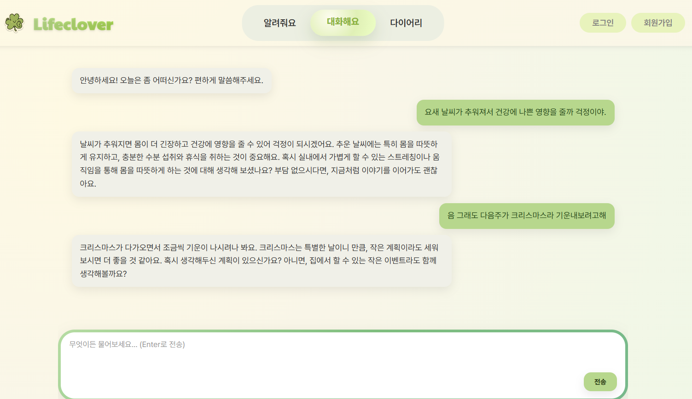<br>

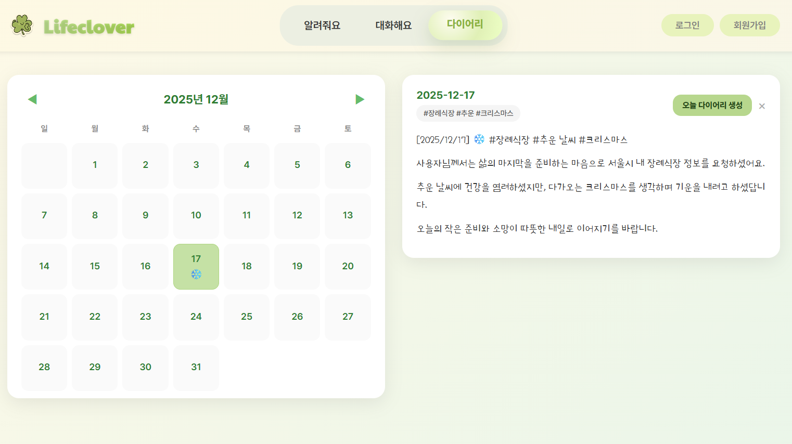<br>

<br>

---

# 🪜 추후 개선 예정

- 서비스 안정성과 확장성을 높이기 위해 임베딩 모델 및 DB 구조를 오픈소스 기반과 관리형 인프라(RDS)로 단계적으로 고도화할 계획

<br>

- 사용자 경험 강화를 위해 채팅 기능의 유연성(대화 관리, 신규 채팅 생성)과 디지털 소외계층을 고려한 UI 개선을 지속적으로 보완

<br>

- 사용자 대화 흐름을 기반으로 제공 정보의 범위와 질문 예시를 점진적으로 확장하여, 더 풍부하고 개인화된 상담 경험을 제공

<br>

---

# ✒️ 한 줄 회고

| 이름 | 회고 |
|----------|-------------|
| 배상준 | 주제가 무거웠던 만큼 지금까지의 다른 프로젝트와는 조금 색다르게 접근했습니다. 다소 무겁거나 처질 수 있는 경험을 사용자에게 부담없이 제공하는 방법을 고민하는 것이 기술적 요소뿐 아니라 서비스 제공자의 입장으로서 귀한 경험이 되었습니다. 랭그래프를 활용해 멀티 에이전트를 오가며 ‘감성’을 가진 챗봇을 만들어보는 것이 어려웠지만 많은 것을 배울 수 있었고, 3차에서부터 이어진 프로젝트를 진행하며 팀원들과 구두 소통만이 아니라 깃허브, 피그마 등 협업 툴을 사용하는 것의 중요성 역시 느낄 수 있었습니다. |
| 박소희 | 이번 프로젝트에서는 프론트엔드 담당으로서 LLM 기반 채팅 UI의 레이아웃 안정성과 사용자 상호작용 흐름 개선을 중심으로 구현과 분석을 진행하였다. 채팅 영역과 입력 영역의 스크롤 컨텍스트를 분리하고 CSS 중복 규칙을 정리함으로써, 스트리밍 환경에서도 레이아웃 흔들림 없이 동작하도록 개선할 수 있었다. 또한 브라우저 캐시로 인한 정적 자산 미반영 문제를 분석하며, Network 레벨에서 원인을 식별하고 캐시 버스터를 적용하는 실무적인 대응 경험을 축적했다. 향후에는 대화형 UI 전반에서의 상태 관리와 렌더링 구조를 고도화하고, 다양한 실행 환경에서도 일관된 사용자 경험을 제공할 수 있는 확장 가능한 프론트엔드 구조를 지향하고자 한다. |
| 이승원 | openai api를 활용함에 있어 생각 없이 임베딩도 openai의 임베딩 모델을 활용했는데 요청이 많아 시간이 지연되는 문제도 있었다. 프로젝트를 함에 있어 다양한 문제 상황이 생길 수 있고 계획하는 단계에서 검토를 충분히 해야겠다는 것을 느꼈다. 그리고 문제를 해결함에 있어 라이브러리의 도큐먼트를 꼼꼼히 확인하는 것의 중요성을 알 수 있었다. |
| 김성욱 | 실사용 환경에 가까운 검증을 위해 “ngrok” 을 활용하여 외부 접속 환경을 구축했습니다. 덕분에 장소와 기기에 구애받지 않고 이동 중에도 테스트를 진행할 수 있었고, 지인들에게 손쉽게 테스트를 요청하여 다양한 사용 패턴과 예외 상황 데이터를 빠르게 수집했습니다. 덕분에 챗봇의 대응 능력을 개선하는 데 큰 도움이 되었습니다. 또한, 팀원 모두 각자의 역할에 책임감을 갖고 임했으며, 적극적인 소통 덕에 견고한 협업 구조를 다질 수 있었습니다. 함께 일하는 방식과 커뮤니케이션의 중요성을 다시금 깨달은 감사한 시간이었습니다. |
| 박진형 | 요구사항 명세서, 화면 설계서, README를 중심으로 프로젝트 문서를 체계적으로 정리했다. 정보의 누락이나 중복 없이 읽히도록 구조와 표현을 다듬는 데 주력했고, 발표와 시연에서 서비스의 의도가 자연스럽게 전달되도록 문서 완성도를 높이기 위해 노력했다. 최종 프로젝트 전 계획 단계에서 무엇을 중점으로 생각해야 할 지 도움되는 유익한 시간이었다. |
